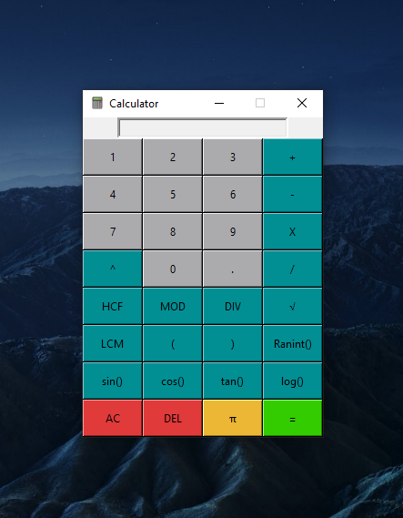

# Advanced Python Calculator

    

An advanced GUI calculator made with the GUI framework called tkinter in Python. This calculator can perform basic and some advanced arithmetic operations.

*Following is a preview of the calculator app:*

